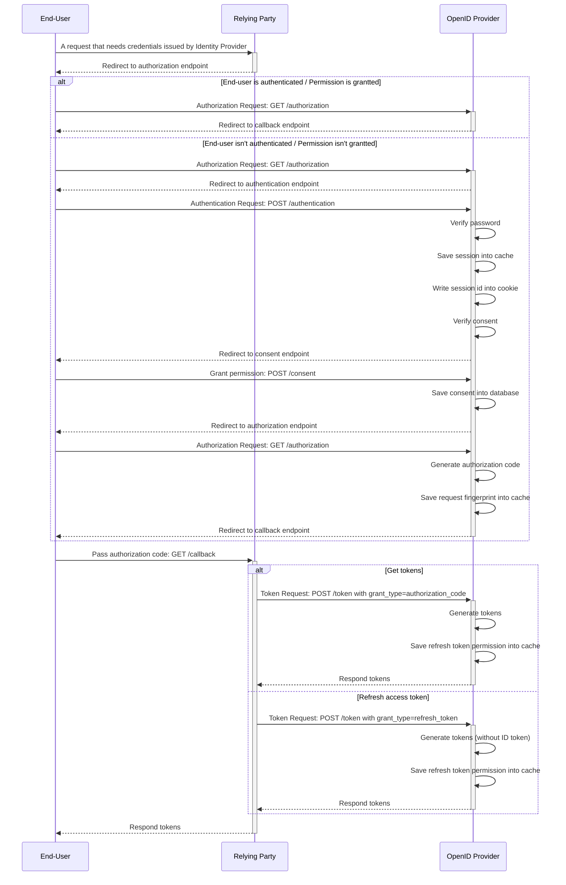

Here is a sequence of Authorization Code flow:

```mermaid
sequenceDiagram
  participant EndUser as End-User
  participant RP as Relying Party
  participant OP as OpenID Provider

  EndUser ->>+ RP: A request that needs credentials issued by Identity Provider
  RP -->>- EndUser: Redirect to authorization endpoint

  alt End-user is authenticated / Permission is grantted
    EndUser ->>+ OP: Authorization Request: GET /authorization
    OP -->>- EndUser: Redirect to callback endpoint
  else End-user isn't authenticated / Permission isn't grantted
    EndUser ->>+ OP: Authorization Request: GET /authorization
    OP -->> EndUser: Redirect to authentication endpoint

    EndUser ->> OP: Authentication Request: POST /authentication
    OP ->> OP: Verify password
    OP ->> OP: Save session into cache
    OP ->> OP: Write session id into cookie
    OP ->> OP: Verify consent
    OP -->> EndUser: Redirect to consent endpoint

    EndUser ->> OP: Grant permission: POST /consent
    OP ->> OP: Save consent into database
    OP -->> EndUser: Redirect to authorization endpoint

    EndUser ->> OP: Authorization Request: GET /authorization
    OP ->> OP: Generate authorization code
    OP ->> OP: Save request fingerprint into cache
    OP -->>- EndUser: Redirect to callback endpoint
  end

  EndUser ->>+ RP: Pass authorization code: GET /callback

  alt Get tokens
    RP ->>+ OP: Token Request: POST /token with grant_type=authorization_code
    OP ->> OP: Generate tokens
    OP ->> OP: Save refresh token permission into cache
    OP -->>- RP: Respond tokens
  else Refresh access token
    RP ->>+ OP: Token Request: POST /token with grant_type=refresh_token
    OP ->> OP: Generate tokens (without ID token)
    OP ->> OP: Save refresh token permission into cache
    OP -->>- RP: Respond tokens
  end

  RP -->>- EndUser: Respond tokens
```
